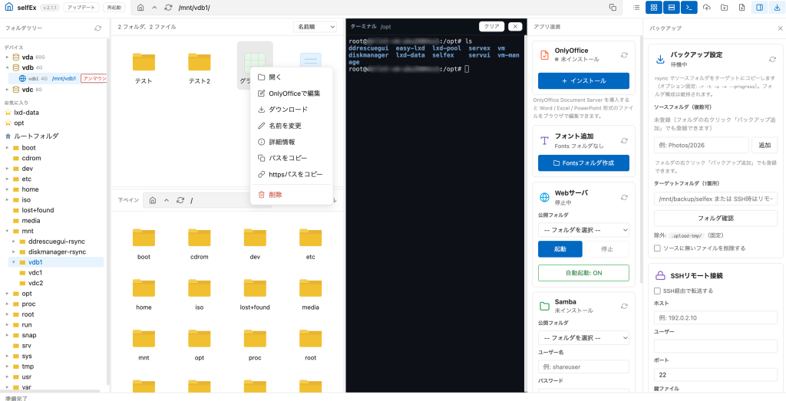

# selfEx

セルフホストして使うファイラーです。 `/` 配下のファイルをブラウザから閲覧・編集できます。

SelfExplorer をホスト用に移植したものです。見た目・操作感はそのままに、インストール先・ポート・ブラウズ対象・名称を変更しています。



## インストール方法

### クイックインストール（推奨）

```bash
sudo bash -c "$(curl -fsSL https://raw.githubusercontent.com/hirogura/selfex/main/install-selfex1.sh)"
```

### 手動インストール

```bash
# 1. リポジトリをクローン
git clone https://github.com/hirogura/selfex.git /tmp/selfex
sudo rsync -a /tmp/selfex/ /opt/selfex/
rm -rf /tmp/selfex

# 2. 設定を編集 (必要に応じて)
# /opt/selfex/server/server.js の PORT, ROOT_DIR を編集
# フロントの表示ルートは /api/config から取得するため app.js の書き換えは不要

# 3. npm 依存関係をインストール
cd /opt/selfex/server
npm install --omit=dev

# 4. systemd サービスをセットアップ
sudo tee /etc/systemd/system/selfex.service <<'EOF'
[Unit]
Description=selfEx File Manager
After=network.target

[Service]
Type=simple
WorkingDirectory=/opt/selfex/server
ExecStart=/usr/bin/node server.js
Restart=always
RestartSec=5
Environment=NODE_ENV=production

[Install]
WantedBy=multi-user.target
EOF

sudo systemctl daemon-reload
sudo systemctl enable selfex
sudo systemctl start selfex

# 5. Tailscale Serve で Tailnet 内のみ HTTPS 公開
sudo tailscale serve --bg --https=3362 "http://127.0.0.1:3362"
```

### インストールスクリプトを使用する場合

`install-selfex1.sh` をダウンロードして実行するか、上記のクイックインストールコマンドを実行してください。

### CachyOS へのインストール

CachyOS（Arch 系）にも対応しています。インストールスクリプトは OS を自動判別し、パッケージ導入に `pacman` を使います。事前に以下を準備してください。

```bash
# 1. 必須パッケージを導入（git / Node.js / Tailscale）
sudo pacman -Sy --needed git nodejs npm tailscale

# 2. クイックインストール（Debian 系と同じコマンド）
sudo bash -c "$(curl -fsSL https://raw.githubusercontent.com/hirogura/selfex/main/install-selfex1.sh)"
```

CachyOS での注意点:

- 不足している `rsync` / `curl` / `python` はスクリプトが `pacman` で自動導入します
- Samba / Docker / sshpass は初回利用時にアプリ画面から導入できます（内部で `pacman -S` が実行されます）。Samba のサービス名は `smb` / `nmb` として扱われます
- Tailscale を使う場合は `sudo systemctl enable --now tailscaled` でデーモンを起動しておいてください
- Docker を使う場合は `sudo systemctl enable --now docker` でデーモンを起動しておいてください（アプリ画面からの導入時は自動で有効化されます）

## OnlyOffice フォント追加（オプション）

OnlyOffice で日本語などのフォントを正しく表示するには、`/Fonts/` にフォントファイル（ttf / otf / woff / woff2）を配置してから、以下のスクリプトを実行します。

```bash
sudo bash -c "$(curl -fsSL https://raw.githubusercontent.com/hirogura/selfex/main/add-fonts.sh)"
```

このスクリプトは以下の処理を行います:

1. `/Fonts/` を OnlyOffice コンテナの `/usr/share/fonts/custom` に read-only マウントで追加（`docker-compose.yml` を自動更新）
2. 変更前の `docker-compose.yml` をタイムスタンプ付きでバックアップ
3. コンテナを再作成（データは保持）
4. コンテナ内でフォントキャッシュを再生成（`fc-cache` / AllFonts.js / テーマ再生成）

注意:

- 実行前に `/Fonts/` にフォントファイルを配置しておいてください（ファイルが 1 件も無い場合は中断します）
- 再実行しても安全です（マウントが既にあればキャッシュ再生成のみ行います）
- 完了後はブラウザキャッシュをクリアしてから OnlyOffice でフォントを確認してください

## 要件

- Node.js 18 以上
- git
- systemd (推奨)
- OnlyOffice 連携には Docker

## アクセス

selfEx は `127.0.0.1` にのみバインドされているため、**Tailnet（Tailscale）内からしかアクセスできません**。LAN やインターネットからの直接アクセスはできません。

- サーバー上: http://localhost:3362
- Tailnet 内: https://`<hostname>.ts.net:3362` (Tailscale Serve が有効な場合)
- OnlyOffice: https://`<hostname>.ts.net:3322` (こちらも Tailnet 内のみ)

### ネットワーク構成

| サービス | バインド | 公開範囲 |
|---|---|---|
| selfEx (3362) | `127.0.0.1` | Tailnet 内のみ |
| OnlyOffice (3322) | `127.0.0.1` | Tailnet 内のみ |

### アンインストール方法

以下の手順でアンインストールできます。

```bash
# 1. サービスを停止・無効化
sudo systemctl stop selfex
sudo systemctl disable selfex

# 2. systemd サービスファイルを削除
sudo rm /etc/systemd/system/selfex.service
sudo systemctl daemon-reload

# 3. インストールディレクトリを削除
sudo rm -rf /opt/selfex

# 4. Tailscale Serve の設定を解除
tailscale serve --https=3362 off
```

注意点:

ブラウズ対象の `/` 配下の実データは削除されません — selfEx はフォルダの中身を表示していただけなので、実データはそのまま残ります。
OnlyOffice(/opt/onlyoffice)は、インストール時に「既存環境を再利用」を選んだ場合は他のサービス(nextExplorer等)とも共有されている可能性があります。selfEx専用に新規インストールしていて、かつ他で使っていないなら削除可能です

```bash
cd /opt/onlyoffice && sudo docker compose down
sudo rm -rf /opt/onlyoffice
```

ただし共有している場合は残しておいてください。

ポート 3362(selfEx本体)・3322(OnlyOffice)を他で使っていないか確認してから解放するのが安全です。

## デバイスのマウント / アンマウント

フォルダツリー上部の「デバイス」欄に、ホストのディスク・パーティション一覧（servEX と同じ方式）を表示します。

- ドライブ名をクリックするとパーティションを展開
- 未マウントのパーティションは「マウント」ボタンからマウント先（例: `/mnt/usb`）を指定してマウント
- マウント済みのパーティションはマウント先リンクのクリックでそのフォルダに移動、「アンマウント」ボタンでアンマウント

## 詳細情報での権限変更

右クリックメニューの「詳細情報」ダイアログ下部「権限変更」欄（servEX と同じ方式）から、所有者・グループ・権限（rwx）を変更できます。

## 2分割表示

ヘッダーの「サムネイル表示」ボタン右にある「2分割表示」ボタンで、エクスプローラを上下2分割にできます（servEX と同じ方式）。

- 下ペインは独自のパスバー（ホーム / 親フォルダ / 更新）で移動
- ペイン間のドラッグ＆ドロップでファイル・フォルダをコピー（同名がある場合はスキップ）
- 区切り線のドラッグで上下の高さを変更
- フォルダツリーの右クリック「下ペインで開く」で指定フォルダを下ペインに表示
- 下ペインでも右クリックメニュー（開く・編集・ダウンロード・名前変更・詳細情報・削除など）が使用可能
- 下ペインの空白右クリックでフォルダ作成・ファイル作成、ドラッグでの複数選択に対応

## お気に入り

フォルダツリー上部の「お気に入り」から項目を選ぶと、その場所までツリーが自動で展開されます。

## ターミナル

ヘッダーの「2分割表示」ボタン右にある「ターミナル」ボタンで、右側にターミナル専用ペインを表示します（servEX と同じ方式・xterm + WebSocket）。

- 2分割表示とは独立して開閉でき、区切り線のドラッグで幅を変更できます（幅は記憶されます）
- フォルダツリーの右クリック「ターミナルで開く」で指定フォルダをカレントにしてターミナルを開きます
- シェルはサービス実行ユーザーで動作します
- xterm.js は `public/vendor/` に同梱しているため外部 CDN は不要です

## rclone バックアップ（クラウド転送）

ヘッダーの「バックアップパネル開閉」ボタン右にある「rcloneパネル開閉」ボタンで、右側に rclone パネル（rcloneGUI 相当）を表示します（開閉状態は記憶されます）。

- クラウドアカウント（Googleドライブ / OneDrive）の追加・OAuth認証・テスト・削除
  - 認証は `rclone authorize` を使用します。ブラウザからのリダイレクトを受けるため、認証ダイアログの「一時SSHを有効化」で SSH トンネル（`ssh -L 53682:127.0.0.1:53682 root@<ホスト>`）を張ってから URL を開きます
- コピー元（ソースフォルダ）は複数指定でき、転送先は「リモート名＋パス」の1箇所のみ
  - 各ソースはフォルダ名を保って転送先直下へコピーされます（例: `Photos/2026` → `gdrive:backup/2026`）
  - 「ソースに無いファイルを削除する」をONにすると `rclone sync` になり、転送先の余分なファイルを削除します
- 実行・監視はバックアップパネルと同じ仕様（間隔実行 / 指定時刻＋曜日）
- ジョブ履歴（完了・失敗・実行中、ログ表示、削除）を保持します（30日）
- 設定: `/var/lib/selfex/rclone.json`、rclone 設定: `/var/lib/selfex/rclone/rclone.conf`、履歴: `/var/lib/selfex/rclone/jobs/`
- rclone が未導入の場合は `apt install rclone` などで導入してください
- 既存の rcloneGUI（`/opt/rclonegui`）の `rclone.conf` がある環境では、初回にその設定を取り込みます

## バージョン

v.2.6.0
